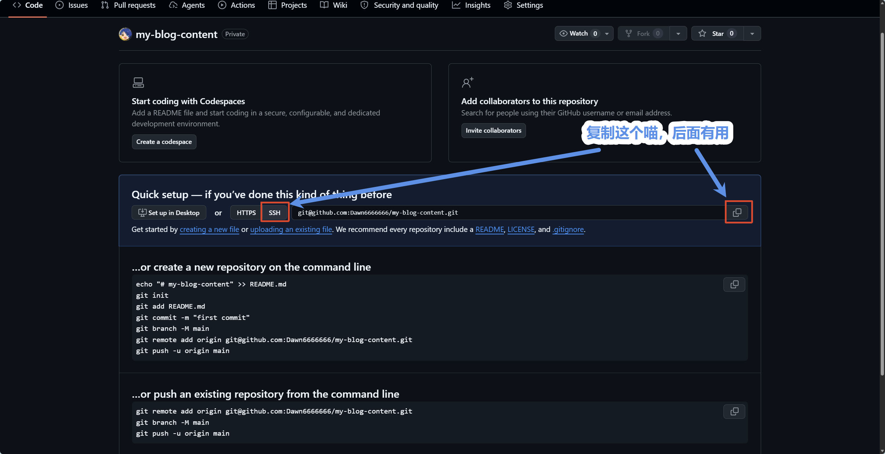
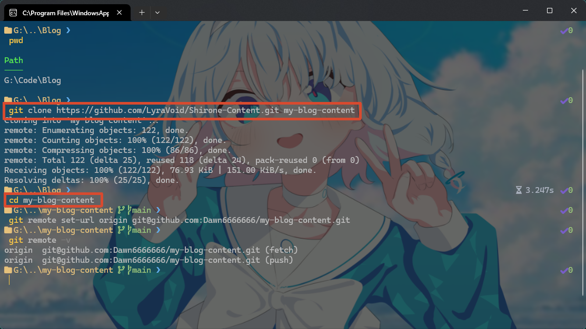
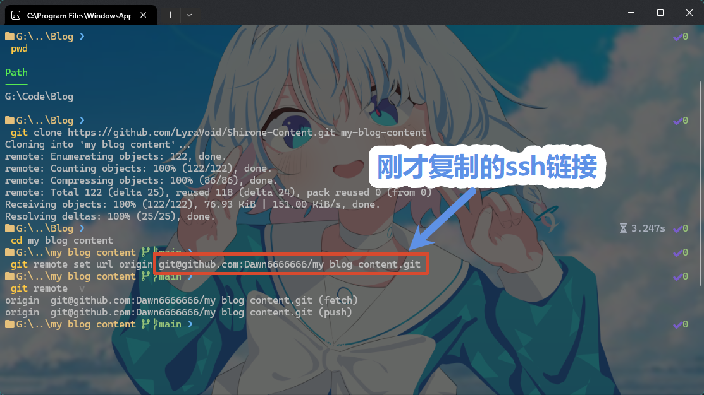
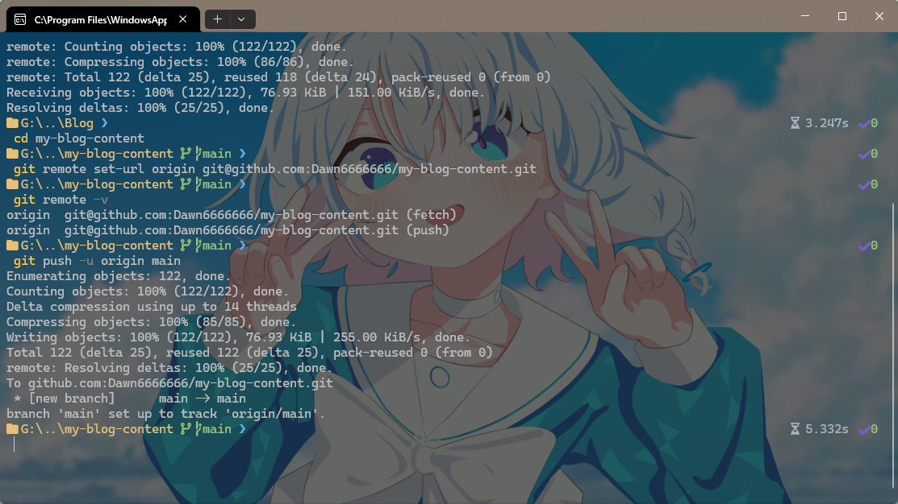

# Initializing Private Content Repository

There are two convenient paths to set up your personal content repository:

- **Method 1 (Highly Recommended): One-Click Decoupling Migration with `content:eject`** — If you already cloned or forked the theme code repository, a single command extracts all posts, moments, albums, page data entities, and base configurations into a standardized external repository.
- **Method 2: Initialize from Official Content Template** — Ideal for new bloggers starting directly with the dual-repository architecture from scratch.

---

## Method 1: One-Click Decoupling Migration (`content:eject`)

If you have already cloned the theme code repository (e.g., `D:\Code\Shirone`), using the built-in decoupling wizard provides the cleanest, safest initialization.

### Why Choose `content:eject`?
- **Automated Directory Assembly**: Automatically extracts posts, moments, albums, and data entities, generating a compliant `shirone.content.json` manifest and GitHub Actions trigger workflow;
- **Minimal Configuration Export**: Exports only essential identity files such as `site.yaml` and `profile.yaml` without hardcoding theme defaults, preserving seamless future upstream upgrades;
- **Repository Safety Guard**: Appends ignore rules to the code repository's `.gitignore` and safely untracks files from Git while preserving them physically on disk for uninterrupted local preview;
- **Automatic Path Binding**: Automatically registers the exported directory with your local development environment.

---

### Step 1: Run Decoupling Command in Theme Repository

Open your terminal, navigate to the **theme code repository** root, and run:

```powershell
# 1. Dry run: preview files to be exported without writing to disk
pnpm.cmd content:eject

# 2. Confirm and execute export (defaults to ../shirone-content in parent directory)
pnpm.cmd content:eject --yes

# Optional: Specify a custom export directory path
pnpm.cmd content:eject --yes --out "D:\Code\my-blog-content"
```

> macOS / Linux users: execute `pnpm content:eject --yes`.

---

### Step 2: Create a Blank Private Repository on GitHub

1. Sign in to your [GitHub](https://github.com/) account;
2. Click the **+** icon in the upper-right corner and select **New repository**;
3. Fill in repository settings:
   - **Repository name**: e.g., `my-blog-content` or `shirone-content`;
   - **Visibility**: **Select Private**;
   - **Initialize this repository with**: **Do not check** any initialization files (keep completely empty);
4. Click **Create repository**.


*Figure 1-1: GitHub private repository creation options*

---

### Step 3: Push Content Repository to GitHub

Open terminal, switch to the newly exported directory, initialize Git, and push:

```bash
# 1. Enter the exported content directory
cd ../shirone-content

# 2. Initialize Git repository and commit
git init -b main
git add .
git commit -m "feat: initialize private blog content repository"

# 3. Add your GitHub remote and push
git remote add origin git@github.com:your_username/my-blog-content.git
git push -u origin main
```

Your private content repository is now fully initialized.

---

## Method 2: Initialize from Official Content Template

If you prefer building a fresh content repository from scratch, clone the official template directly:

### Step 1: Create a Blank Private Repository on GitHub
Follow the instructions above to create an empty Private repository on GitHub (without README, license, or .gitignore).


*Figure 1-2: GitHub empty repository clone instructions*

### Step 2: Clone Official Template Locally
Run in your terminal:

```bash
# 1. Clone official content template
git clone https://github.com/LyraVoid/Shirone-Content.git my-blog-content

# 2. Enter the cloned directory
cd my-blog-content
```


*Figure 1-3: Cloning official template repository locally*

### Step 3: Redirect Remote Origin to Your Private Repository

```bash
# Update origin URL to your newly created private repository
git remote set-url origin git@github.com:your_username/my-blog-content.git

# Verify remote configuration
git remote -v
```


*Figure 1-4: Verifying remote repository URL redirection*

### Step 4: Push Initial Commit to Your Private Repository

```bash
# Push template content to your private repository main branch
git push -u origin main
```


*Figure 1-5: Pushing template content to personal private repository*

Refresh your GitHub repository page to verify the ready directory structure:


*Figure 1-6: Initialized private content repository structure*

---

## Content Repository Directory Structure Overview

Regardless of the initialization method chosen, your content repository contains the following core layout:

```text
my-blog-content/
├── .github/workflows/       # GitHub Actions automated build trigger workflow
│   └── trigger-build.yml.example # Workflow template (drop .example to enable)
├── config/                  # Site customization YAML files
│   ├── site.yaml            # Basic site identity, color system, and banner
│   └── profile.yaml         # Author avatar, nickname, bio, and social links
├── content/                 # Original posts and moments
│   ├── posts/               # Markdown / MDX long-form articles
│   ├── moments/             # Micro-blogging timeline moments
│   └── spec/                # About and friends application copy
├── data/                    # Structured data entities (devices, friends, projects, skills)
├── public/                  # Custom photo albums and static media assets
└── shirone.content.json     # Content repository protocol manifest
```

---

## Next Steps

Once your content repository is set up, proceed with:
- [03. Local Preview and Real-Time Debugging](./03-local-preview.md) — Launch the local dev server for live hot-reload preview;
- [04. CLI Tooling and Collaborative Workflows](./04-cli-workflows.md) — Master CLI commands for preflight validation, status checking, and bidirectional synchronization.
