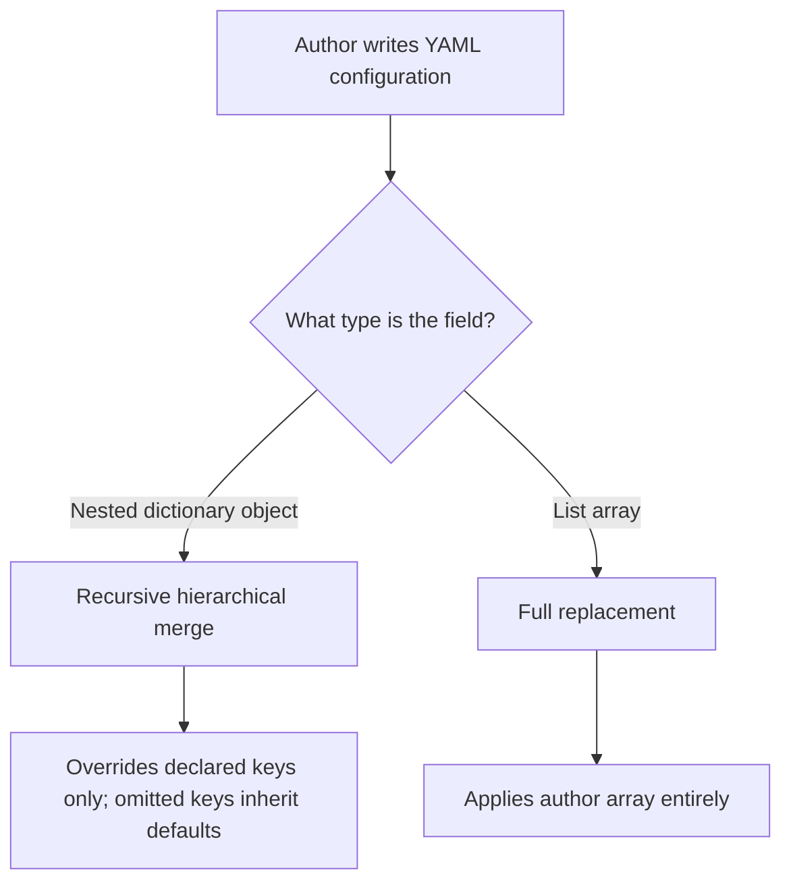

# Configuration Overlay Core Principles

In the Shirone blog ecosystem, site-wide configuration follows a **declarative overlay mechanism**. You never need to modify or fork the core theme source code; simply author concise YAML configuration files in the content repository's `config/` directory to customize every aspect of your site.

---

## Core Design Principles

### 1. Minimal Configuration Overlay Principle
In your YAML files, you **only declare the keys you wish to customize**. Unspecified fields automatically inherit the theme's built-in default configuration.

This architecture provides two major advantages:
- **Clean and Concise Files**: No need to maintain thousands of lines of boilerplate configuration;
- **Seamless Upstream Upgrades**: When the theme releases updates introducing new options or enhanced defaults, your blog automatically inherits these improvements without breaking existing customizations.

### 2. Recursive Object Merge vs. Full Array Replacement

When merging YAML configurations, the system applies two explicit rules:



- **Nested Objects (Recursive Hierarchical Merge)**:
  For example, in `site.yaml`, if you only want to adjust the typewriter typing speed on the banner:
  ```yaml
  banner:
    homeText:
      typewriter:
        speed: 150
  ```
  Deleting speed, pause duration, and carousel parameters still inherit their theme defaults.

- **List Arrays (Full Replacement)**:
  All array-typed lists (such as top navigation items in `nav-bar.yaml`, sidebar components in `sidebar.yaml`, social links in `profile.links`, and favicon definitions in `site.favicon`) use **full replacement**.
  Because the order, presence, and grouping of list items form an indivisible set, partial patching can create ambiguity. Therefore, when defining an array, list all items you want to render.

---

## Configuration Validation and Error Prevention

### 1. In-Memory Typo Diagnostics

When modifying YAML, typos or incorrect data types may accidentally occur.

Shirone incorporates a strict preflight diagnostic validator. During `pnpm content:validate` or content synchronization, the system validates configurations in memory. When a typo is detected, the terminal highlights the exact file and property path along with an intelligent suggestion:

```text
  config/site.yaml's banner.homeText: Type '{ titel: string }' is not assignable to type 'DeepPartial<HomeTextConfig>'
    Did you mean "title"?
```

This fast feedback loop allows you to catch and fix configuration mistakes locally before deploying to production.

### 2. How Configuration Takes Effect (Configuration Bridge)

During synchronization (`pnpm content:sync`) or production builds, the system compiles all YAML files in `config/` into the `src/user/user-config.ts` configuration bridge file.

This automated compilation step performs key optimizations:
- **Offline Icon Bundling**: Scans all Iconify icon names referenced across configurations and packages them into local bundles at build time, eliminating external runtime icon requests;
- **Text Extraction for Font Subsetting**: Gathers site titles, author nicknames, and bio text for inclusion in the automated font subsetting pipeline;
- **Zero Manual Maintenance**: The configuration bridge is fully managed by the build system and regenerated on every sync.

---

## Site Configuration Quick Reference Table

All configuration files reside in the content repository's `config/` directory:

| Configuration File | Functional Domain | Default Overlay Strategy |
| :--- | :--- | :--- |
| `config/site.yaml` | Site identity, banner wallpaper, carousel, typewriter, background textures | Recursive object merge |
| `config/profile.yaml` | Author avatar, nickname, bio, social platform links | Object merge (`links` array replaced) |
| `config/nav-bar.yaml` | Top navigation links, preset items, dropdown submenus | Full array replacement (dedicated overlay type) |
| `config/sidebar.yaml` | Single/dual column layout, sidebar component ordering and sticky rules | Object merge (`components` array replaced) |
| `config/font.yaml` | CJK fonts, Latin body fonts, monospace fonts, automated font subsetting | Object merge (`fontFamilies` array replaced) |
| `config/anime.yaml` | Anime tracking data source, Bilibili/Bangumi sync policies | Recursive object merge |
| `config/music.yaml` | Sidebar music player modes, NetEase playlists, custom tracks | Recursive object merge |
| `config/comment.yaml` | Comment system provider and Twikoo connection parameters | Recursive object merge |
| `config/context-menu.yaml` | Desktop context menu actions, ordering, and page filters | Object merge (`actions` array replaced) |
| `config/post-list.yaml` | Post list pagination size, list or grid presentation modes | Recursive object merge |
| `config/article.yaml` | Reading time, outdated post warnings, related posts, poster generation | Recursive object merge |
| `config/devices.yaml` | Personal devices showcase categories and filter rules | Object merge (`categories` array replaced) |
| `config/projects.yaml` | Open source projects showcase categories and phase filters | Object merge (`categories` array replaced) |
| `config/skills.yaml` | Skills matrix categories and proficiency levels | Object merge (`categories` array replaced) |
| `config/timeline.yaml` | Milestones timeline categories and chronological ordering | Object merge (`categories` array replaced) |
| `config/fab.yaml` | Floating action buttons list and alignment margins | Object merge (`items` array replaced) |
| `config/image-bloom.yaml` | Image loading bloom placeholder animation parameters | Recursive object merge |
| `config/expressive-code.yaml` | Code block highlighting light and dark color themes | Recursive object merge |
| `config/license.yaml` | Article footer copyright license statements | Recursive object merge |
| `config/announcement.yaml` | Homepage top announcement banner copy, type, and call-to-action link | Recursive object merge |
| `config/llms.yaml` | LLM discovery endpoints (/llms.txt), tag exclusion, core pages index | Object merge (`corePages` array replaced) |
| `config/umami.yaml` | Umami public analytics and optional visit tracking (`websiteId` and `scriptUrl` are paired) | Recursive object merge |
| `config/footer.yaml` | Custom HTML injection master toggle for site footer | Recursive object merge |
| `config/footer.html` | Custom HTML snippet source code for site footer | Direct 1:1 file mapping |

