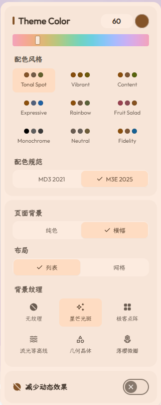
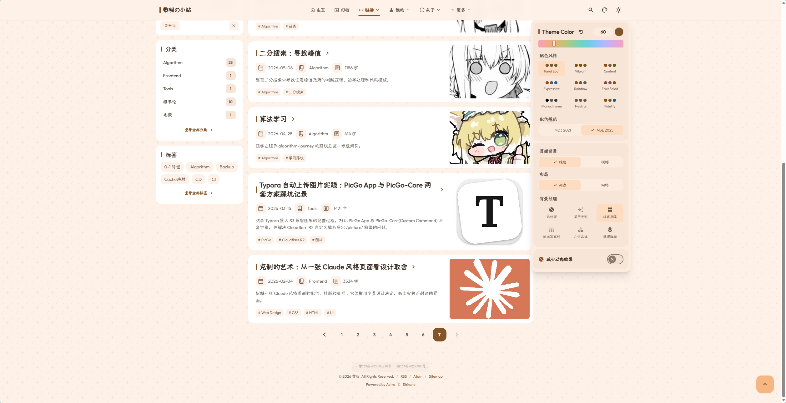
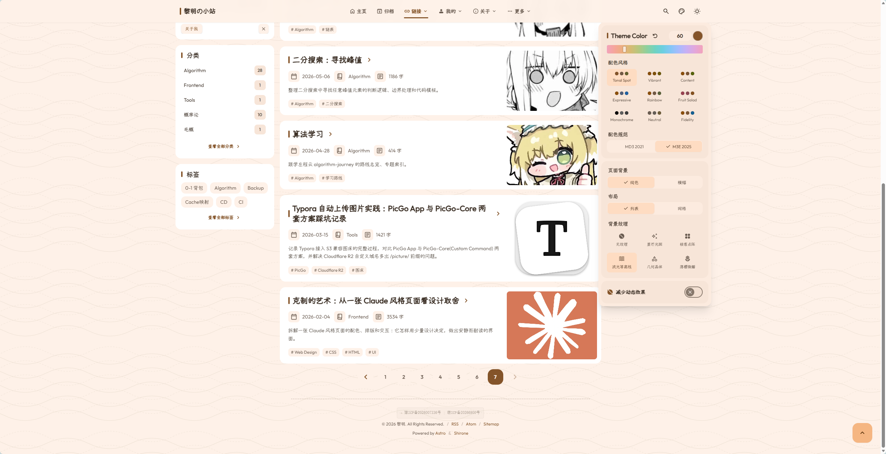
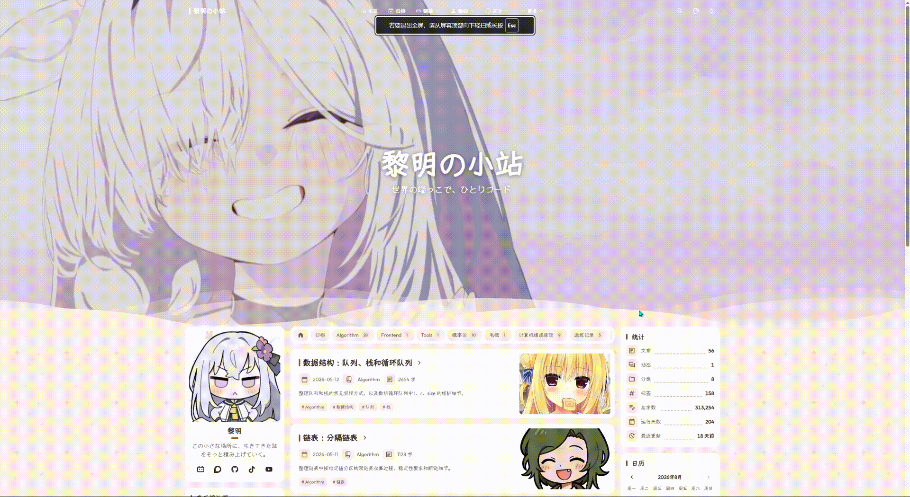

# Site Foundation and Visual Customization

`config/site.yaml` is the primary configuration file for your blog, governing site identity, the color system, banner wallpaper, and background textures.

---

## Complete Configuration Example and Property Guide

```yaml
# 1. Basic Site Identity
# Deployed production root URL, must end with a trailing slash
site: "https://www.example.com/"

# Site subdirectory path; keep as "/" if deployed at domain root
base: "/"

# Site title and subtitle (displayed in browser tabs, RSS feeds, and SEO metadata)
title: "My Tech & Life Log"
subtitle: "Quietly documenting traces of life and code."

# Default language code:
# Supported: zh_CN (Simplified Chinese) | zh_TW (Traditional Chinese) | en (English) | ja (Japanese)
# Also: ko (Korean) | es (Spanish) | th (Thai) | vi (Vietnamese) | tr (Turkish) | id (Indonesian)
lang: "en"

# Site timezone (IANA time zone identifier, e.g. "Asia/Shanghai", "Asia/Tokyo", "America/New_York")
# Used to interpret exact post/moment publication timestamps (publishedAt / updatedAt) and order articles
# Timezone is independent of lang: switching display language never shifts archive calendar dates or article order
timeZone: "Asia/Shanghai"

# 2. Desktop Top App Bar Layout
topAppBar:
  # Content alignment: "center" (centered, recommended) | "left" (left-aligned)
  contentAlign: "center"

# 3. Visitor Display Settings Panel
# Controls toggles available to visitors in the top-right display preferences dialog
displaySettings:
  colorStyle: true       # 3x3 color style matrix picker
  colorSpec: true        # Design specification switcher
  wallpaperMode: true    # Page background (wallpaper / solid) switcher
  layoutMode: true       # List / grid layout switcher
  reduceMotion: true     # Reduced motion switcher
  texture: true          # Background texture switcher

# 4. Theme Color System
themeColor:
  # Default hue value (0 to 360; e.g., 315 for pink-purple, 262 for violet, 345 for sakura pink)
  hue: 315
  # Lock color for visitors (if true, hides color palette in preferences)
  fixed: false
  # Color scheme style (supports 9 algorithmic derivation modes):
  # - tonalSpot: Default, gentle low saturation
  # - vibrant: High saturation and vivid tones
  # - expressive: Expressive multi-accent palette
  # - rainbow: Rainbow spectrum palette
  # - fruitSalad: Fresh fruit salad palette
  # - monochrome: Minimalist black, white, and gray monochrome
  # - neutral: Gentle neutral palette
  # - fidelity: Faithful match to baseline hue
  # - content: Content-adaptive dynamic palette
  style: "tonalSpot"
  # Design spec version: "2025" (recommended) or "2021"
  spec: "2025"
```

Visitor display preferences panel and color palette dialog:


*Figure 1-1: Display preferences panel and theme color palette*

```yaml
# 5. Default Background Mode
wallpaperMode:
  # Initial page background state: "banner" (show wallpaper) | "none" (clean solid color)
  defaultMode: "banner"

# 6. Background Texture System
texture:
  enable: true
  # Default texture preset (supports 6 styles):
  # - "none": No texture
  # - "starlight": Subtle starlight shimmer (recommended default)
  # - "cyber-dots": Cyberpunk grid and crosshair reticles
  # - "topography": Flowing contour line ripples
  # - "geometric": Low-poly crystalline origami polygons
  # - "sakura": Falling cherry blossom petals
  defaultPreset: "starlight"
  # Texture opacity (recommended range 0.05 to 0.25, default 0.12)
  defaultOpacity: 0.12
  # Allow micro-animations (automatically disabled when visitors enable reduced motion)
  allowMotion: true
```

Background texture examples:


*Figure 1-2: Starlight shimmer background texture*


*Figure 1-3: Cyber dots background texture*


*Figure 1-4: Topography contour background texture*

```yaml
# 7. Banner Wallpaper and Carousel
banner:
  src:
    # Desktop widescreen image list (single or multiple images)
    # Place in assets/images/banner/ for build-time WebP optimization
    desktop:
      - "assets/images/banner/desktop/1.webp"
      - "assets/images/banner/desktop/2.webp"
    # Mobile viewport image list
    mobile:
      - "assets/images/banner/mobile/1.webp"
  # Image cropping focus: "top" | "center" | "bottom"
  position: "center"
  # Dim overlay (semi-transparent dark layer to enhance text legibility)
  dim:
    enable: true
    opacity: 0.24
  # Homepage banner typography
  homeText:
    enable: true
    title: "My Tech & Life Log"
    # Subtitle list (typed sequentially by the typewriter effect)
    subtitle:
      - "Quietly documenting traces of life and code"
      - "Those who chase the light will shine bright"
    # Typewriter animation settings
    typewriter:
      enable: true
      speed: 120         # Typing interval per character in milliseconds
      deleteSpeed: 50     # Deletion interval per character in milliseconds
      pauseTime: 2000     # Pause duration after completing a line in milliseconds
      loop: true          # Loop through subsequent subtitle lines
  # Multi-image automatic carousel (falls back to static display for single image)
  carousel:
    enable: true
    interval: 6000        # Slide transition interval in ms (minimum 3000)
    fadeDuration: 1200    # Crossfade transition duration in ms
    # Camera motion animation mode:
    # - "ken-burns": Smooth camera zoom and pan breathing (default)
    # - "zoom-in": Gentle zoom in
    # - "zoom-out": Gentle zoom out
    # - "pan-left": Smooth pan left
    # - "pan-right": Smooth pan right
    # - "none": Static with no camera movement
    animation: "ken-burns"
  # Bottom dynamic wave effect (disabling suppresses wave markup generation)
  waves:
    enable: true
```

Homepage banner multi-image carousel and dynamic wave animation:


*Figure 1-5: Banner carousel and dynamic wave effect*

```yaml
# 8. Remote Image Anti-Hotlinking Configuration
imageOptimization:
  # Adds no-referrer attributes for specified image host domains
  noReferrerDomains:
    - "*.hdslb.com"
    - "*.bilibili.com"

# 9. Table of Contents Depth
toc:
  enable: true
  depth: 2               # Maximum heading level to include (1 to 3)

# 10. Page Loading Progress Indicator
progressIndicator:
  # Style: "dual" (bidirectional scanning glow, default) | "single" (unidirectional)
  style: "dual"

# 11. Favicon Configuration
favicon:
  - src: "/favicon/icon.png"
    theme: "light"       # Optional: "light" or "dark"
    sizes: "32x32"
```
