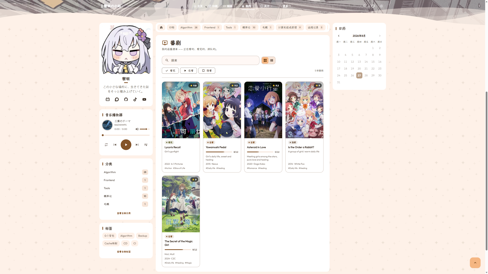
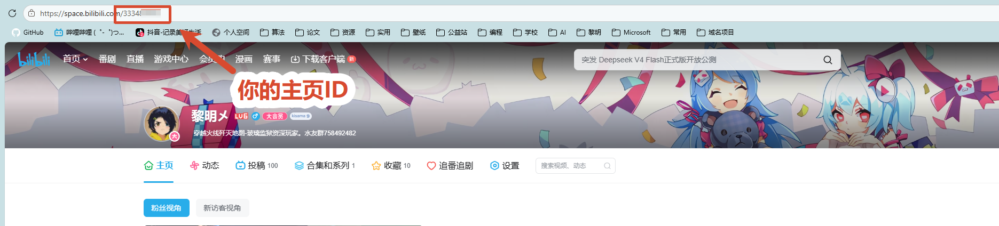
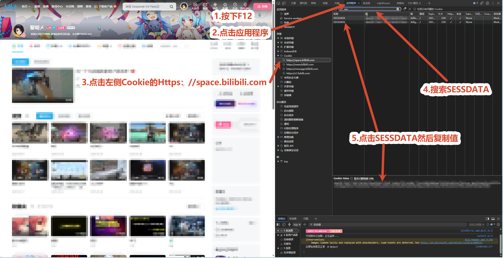

# Anime and Drama Tracking Page Configuration

`config/anime.yaml` manages data sources and rendering policies for the `/anime/` tracking page.

---

## Core Design Philosophy

The anime tracking page employs a **local-first and zero client-side blocking** architecture:
- Regardless of external synchronization providers, the client browser never sends blocking requests directly to Bilibili or Bangumi;
- External data is fetched and stored as local snapshot files during build time, ensuring fast local rendering unaffected by third-party API instability;
- If external API requests fail or time out, the system silently falls back to local data in `data/anime.ts` to prevent broken layouts.

Anime tracking page rendering preview:


*Figure 1-1: Anime and drama tracking page cards and progress bars*

---

## Operating Modes

### Mode 1: Pure Local Data Mode (Recommended Default)

Best for maintaining watchlists manually with zero external dependencies and guaranteed stability.

```yaml
enable: true

source:
  kind: "local"         # Reads directly from data/anime.ts
```

Simply append anime entries in TypeScript format within `data/anime.ts`. Ratings, episode progress, and status tags are generated automatically.

---

### Mode 2: Bangumi Account Synchronization

Synchronizes anime and drama collections from your public Bangumi account.

```yaml
enable: true

source:
  kind: "snapshot"
  provider: "bangumi"
  file: "bangumi.json"
  fetchOnDev: true

fallback:
  kind: "local"         # Falls back to data/anime.ts on sync failure

providers:
  bangumi:
    enable: true
    userId: "your_bangumi_username_or_id"
    request:
      pageSize: 30       # Items fetched per page
      maxItems: 300      # Upper limit of fetched items
      minDelayMs: 300    # Rate limiting delay in milliseconds
```

---

### Mode 3: Bilibili Watchlist Synchronization

Synchronizes anime and drama watchlists from your Bilibili space.

```yaml
enable: true

source:
  kind: "snapshot"
  provider: "bilibili"
  file: "bilibili.json"
  fetchOnDev: true

fallback:
  kind: "local"

providers:
  bilibili:
    enable: true
    # Numeric UID of your Bilibili user space (e.g., 114514)
    vmid: "114514"
    # Environment variable name holding SESSDATA (never hardcode tokens in YAML)
    sessdataEnv: "BILI_SESSDATA"
    # Cover image handling mode:
    # - "local": Downloads cover images locally during build, zero external requests (recommended)
    # - "remote": Loads direct image links from Bilibili
    # - "none": Disables covers, using theme color gradients instead
    cover:
      mode: "local"
      useWebp: true
```

#### Obtaining Bilibili Space UID:
Open your personal space page; the trailing number in the URL is your UID:


*Figure 1-2: Bilibili personal space URL and UID location*

#### Obtaining Bilibili SESSDATA:
Locate the stored Cookie entry in your browser's Developer Tools:


*Figure 1-3: Retrieving SESSDATA credential from browser cookies*

> Security Notice: If your Bilibili watchlist is set to private, configure `BILI_SESSDATA` in GitHub Actions Secrets or your local environment. **Never commit raw cookie credentials into YAML configuration files.**
