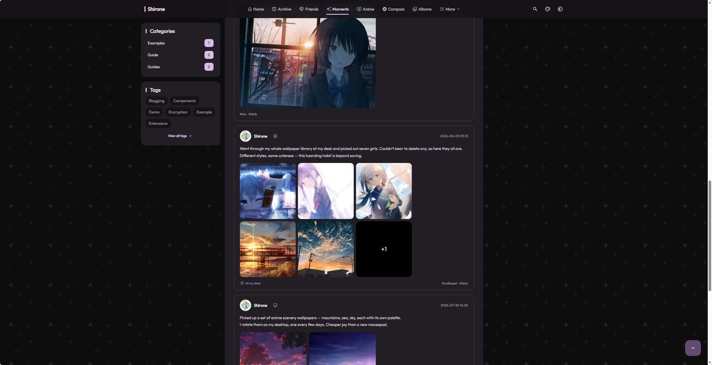

# Moments Publishing Guide

Moments are lightweight micro-posts designed for capturing spontaneous thoughts, brief essays, daily updates, or photography snapshots, rendered on the `/moments/` timeline.

---

## Creating a New Moment

Create a new Markdown file inside the content repository under `content/moments/`.

We recommend date-prefixed filenames, for example:
`content/moments/2026-08-27-cafe-afternoon.md`

---

## Moment Metadata and Content Format

Every moment file contains YAML frontmatter:

```yaml
---
# Publication timestamp (required; includes hours, minutes, and seconds)
published: 2026-08-27 16:45:00

# Location (optional)
location: "Beijing · Chaoyang"

# Mood icon (optional; Iconify icon identifier)
mood: "material-symbols:sentiment-satisfied-outline-rounded"

# Tags list (optional)
tags:
  - "Daily"
  - "Cafe"

# Pin to top of moments stream (defaults to false)
pinned: false

# Draft flag (defaults to false)
draft: false

# Photo grid image list (optional; supports multiple images)
images:
  - src: "https://example.com/photo1.webp"
    alt: "Afternoon tea snapshot"
  - src: "https://example.com/photo2.webp"
    alt: "Coffee latte art"
---

The afternoon sun was gentle today. Spent hours coding at my favorite corner cafe.
The autumn breeze makes everything feel calm and refreshing.
```

Moments timeline and image grid preview:


*Figure 1-1: Moments timeline feed and multi-image card layout*

---

## Recommended Mood Icons

Discover additional icons on [Icones Icon Explorer](https://icones.js.org/). Popular choices include:

- Happy & Cheerful: `material-symbols:sentiment-satisfied-outline-rounded`
- Excited: `material-symbols:sentiment-excited-outline-rounded`
- Focused & Neutral: `material-symbols:sentiment-neutral-outline-rounded`
- Tired: `material-symbols:sentiment-sad-outline-rounded`
- Inspired: `material-symbols:lightbulb-outline-rounded`
