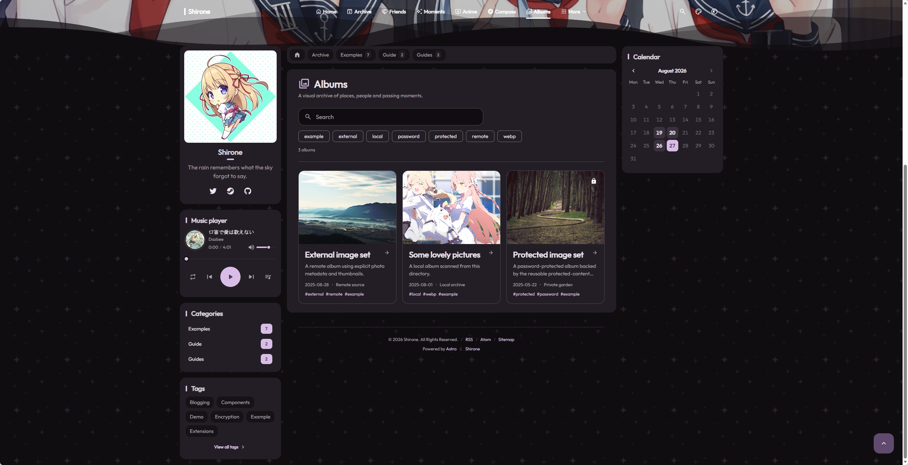
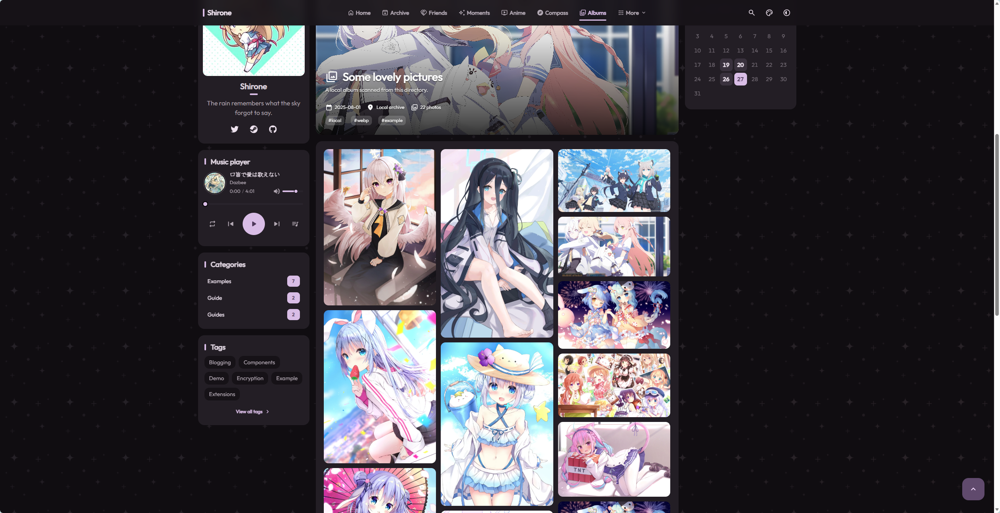

# Photo Album Management Guide

Shirone provides a data-driven, directory-based masonry gallery system accessible at `/albums/`.

---

## Creating a New Album

Under `public/images/albums/` in your content repository, create a dedicated folder for each album (the folder name becomes the album route segment):

```text
public/images/albums/
├── KyotoTrip/            # Album folder
│   ├── info.json         # Album metadata configuration
│   ├── cover.webp        # Album cover image
│   ├── 01.webp           # Photo 1
│   └── 02.webp           # Photo 2
```

Every album folder must contain an `info.json` configuration file.

Albums index page featuring cover cards:


*Figure 1-1: Albums index cover cards layout*

Detailed masonry gallery inside an album:


*Figure 1-2: Photo masonry gallery inside album view*

---

## Album Operating Modes

### Mode 1: Local Photo Album

Place images directly within the album folder. The build system scans zero-padded numeric filenames (`01.webp`, `02.webp`):

```json
{
  "title": "Kyoto Memories",
  "description": "Walking through Sannenzaka on a rainy morning",
  "date": "2026-08-15",
  "location": "Kyoto, Japan",
  "tags": ["Travel", "Photography"],
  "layout": "masonry",
  "columns": 3,
  "hidden": false
}
```

> Naming Tip: Use zero-padded numbering (such as `01.webp`, `02.webp`) to ensure images display in your desired chronological order.

---

### Mode 2: External Remote Album

For large photo libraries hosted on external image CDNs or cloud storage buckets, set `mode: "external"` and define photos in the `photos` array:

```json
{
  "mode": "external",
  "title": "Landscape Collection",
  "description": "Majestic moments of nature and mountains",
  "date": "2026-08-01",
  "cover": "https://img.example.com/cover.webp",
  "tags": ["Landscape"],
  "layout": "masonry",
  "columns": 3,
  "photos": [
    {
      "src": "https://img.example.com/photo1.webp",
      "title": "Golden Sunrise on Snow Peaks",
      "description": "First morning light illuminating the mountain summit",
      "width": 1920,
      "height": 1080
    },
    {
      "src": "https://img.example.com/photo2.webp",
      "title": "Milky Way Galaxy",
      "width": 1920,
      "height": 1080
    }
  ]
}
```

> Best Practice: Always provide `width` and `height` dimensions to prevent cumulative layout shift (CLS) during masonry rendering.

---

### Mode 3: Password-Protected Album

Add a `"password"` property in `info.json` to lock an album:

```json
{
  "title": "Private Family Album",
  "description": "Family gathering memories",
  "date": "2026-08-20",
  "password": "your_private_password",
  "layout": "masonry",
  "columns": 3
}
```

Visitors must enter the matching password to view photos inside the album.

---

## Advanced Album Properties

Configure optional properties in `info.json`:

| Property | Type | Default | Description |
| :--- | :--- | :--- | :--- |
| `layout` | string | `"masonry"` | Gallery layout: `"masonry"` (waterfall flow) or `"grid"` (fixed height grid) |
| `columns` | number | `3` | Number of columns on desktop displays (`1` to `6`) |
| `hidden` | boolean | `false` | If `true`, hides the album from the index listing while keeping it accessible via direct URL |
| `cover` | string | None | Custom cover image URL/path; defaults to `cover.webp` or the first image |
