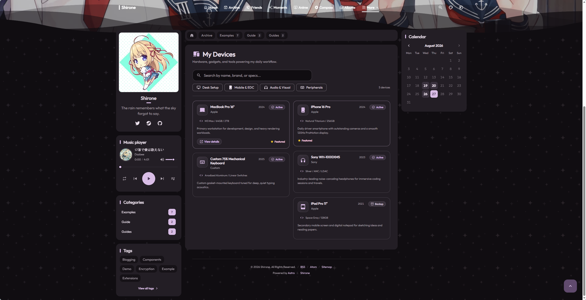
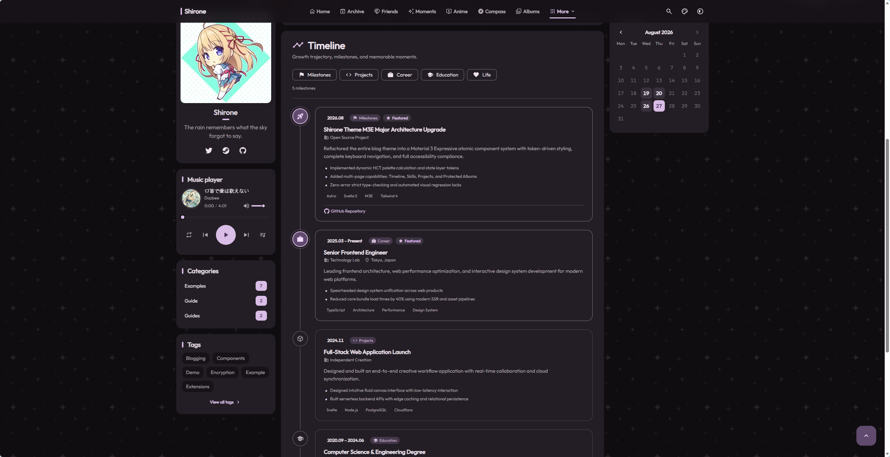

# Page Data Entities Maintenance

In addition to regular posts and moments, Shirone includes specialized showcase pages (such as devices, friends, projects, skills, timeline, compass, anime, and music).
Data entities for these pages reside in the content repository under `data/`, formatted as clean, strongly typed TypeScript files.

---

## 1. Personal Devices Showcase: `data/devices.ts`

Rendered at: `/devices/`

```typescript
export const devicesData = [
  {
    id: "macbook-pro",
    name: "MacBook Pro 16",
    brand: "Apple",
    category: "desk",              // Matches category key in config/devices.yaml
    status: "active",              // Status: "active" | "backup" | "archived" | "wishlist"
    specs: "M3 Max / 64GB / 2TB",  // Hardware specifications
    description: "Primary development and design workstation.",
    icon: "material-symbols:laptop-mac-rounded",
    featured: true,                // Displays featured badge
    year: "2024",
    link: "https://www.apple.com/macbook-pro/"
  }
];
```

Personal devices showcase page layout:


*Figure 1-1: Personal devices showcase card layout*

---

## 2. Friend Links: `data/friends.ts`

Rendered at: `/friends/`

```typescript
export const friendsData = [
  {
    id: 1,
    title: "Friend A's Blog",
    imgurl: "https://example.com/avatar.webp",
    desc: "Passionate about life and open source technologies",
    siteurl: "https://example.com",
    tags: ["Tech", "Frontend"]     // Tags generate filter buttons at the top of the page
  }
];
```

---

## 3. Open Source Projects: `data/projects.ts`

Rendered at: `/projects/`

```typescript
export const projectsData = [
  {
    key: "my-app",
    title: "Super Toolbox",
    summary: "An elegant, feature-rich desktop utility.",
    category: "app",               // Matches category key in config/projects.yaml
    phase: "shipped",              // Phase: "shipped" | "building" | "exploring"
    technologies: ["Svelte", "TypeScript", "Tailwind CSS"],
    icon: "material-symbols:apps-rounded",
    featured: true,
    repository: "https://github.com/yourname/my-app",
    website: "https://app.example.com",
    year: "2026"
  }
];
```

---

## 4. Skills Matrix: `data/skills.ts`

Rendered at: `/skills/`

```typescript
export const skillsData = [
  {
    name: "TypeScript",
    description: "Strict type system design and application architecture.",
    icon: "simple-icons:typescript",
    category: "frontend",
    level: "expert"                // Level: "beginner" | "intermediate" | "advanced" | "expert"
  }
];
```

---

## 5. Milestone Timeline: `data/timeline.ts`

Rendered at: `/timeline/`

```typescript
export const timelineData = [
  {
    title: "Blog Architecture Redesign",
    date: "2026.08",
    category: "milestone",
    subtitle: "Personal Site Upgrade",
    description: "Implemented content separation architecture with dramatic speed improvements.",
    highlights: [
      "Dual-repository decoupling and automated build pipeline",
      "Optimized site-wide CJK font payload size"
    ],
    tags: ["Astro", "Frontend"],
    icon: "material-symbols:rocket-launch-rounded",
    featured: true
  }
];
```

Timeline milestone node layout:


*Figure 1-2: Milestone timeline node layout*

---

## 6. Site Compass Navigation: `data/compass.ts`

Rendered at: `/compass/`

```typescript
export const compassData = [
  {
    key: "dev",
    name: "Developer Tools",
    icon: "material-symbols:code-rounded",
    blurb: "Essential utilities and reference documentation for daily coding",
    entries: [
      {
        label: "GitHub",
        href: "https://github.com",
        note: "Global open-source code hosting platform",
        icon: "fa6-brands:github"
      },
      {
        label: "MDN Web Docs",
        href: "https://developer.mozilla.org",
        note: "Authoritative modern web standards and API reference",
        icon: "material-symbols:menu-book-rounded"
      }
    ]
  }
];
```

---

## 7. Local Anime Watchlist: `data/anime.ts`

Rendered at: `/anime/`

```typescript
export const animeData = [
  {
    title: "Frieren: Beyond Journey's End",
    type: "tv",
    status: "completed",           // Status: "watching" | "completed" | "planned" | "on_hold" | "dropped"
    rating: 9.8,
    progress: { current: 28, total: 28 },
    cover: "/assets/anime/frieren.webp",
    tags: ["Fantasy", "Adventure", "Healing"],
    description: "Follows elven mage Frieren on her journey following the hero party's passing."
  }
];
```

---

## 8. Local Music Tracks: `data/music.ts`

Used by the sidebar music player in local or mixed mode:

```typescript
export const musicTracks = [
  {
    id: "track-1",
    title: "口笛で愛は歌えない",
    artist: "Dazbee",
    cover: "assets/images/music/dazbee.webp",
    source: "/assets/music/dazbee.mp3",
    duration: 241
  }
];
```
