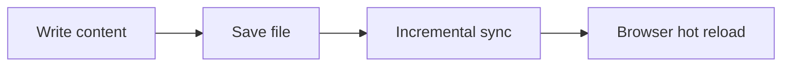

# Extended Markdown Syntax Reference

Shirone incorporates a comprehensive suite of Markdown extension components adhering to Material 3 Expressive standards. All components are statically rendered via AST transformers at build time, ensuring zero runtime layout shifts and minimal client payload.

---

## 1. Callout Containers

### Custom Triple-Colon Container Syntax

```markdown
:::note
This is an informational note container.
:::

:::tip
This is a helpful tip container.
:::

:::important
This is an important notice container.
:::

:::warning
This is an operational warning container.
:::

:::caution
This is a high-risk caution container.
:::
```

### GitHub Alert Blockquote Compatibility
Standard GitHub alert blockquotes are also fully supported:

```markdown
> [!NOTE]
> Informational note content

> [!TIP]
> Helpful tip content

> [!IMPORTANT]
> Important notice content

> [!WARNING]
> Operational warning content

> [!CAUTION]
> Caution alert content
```

---

## 2. Directory File Trees and Code Trees

### Directory File Trees (`:::file-tree`)
Used to present clear project structures or directory trees, supporting both nested lists and terminal output:

```markdown
:::file-tree{title="Project Directory Structure" icon="colored"}
- src/
  - components/
    - atoms/
    - molecules/
    - organisms/
  - config/
    - siteConfig.ts
  - content/
    - posts/
- public/
- package.json
:::
```

You can also use fenced code block syntax to display terminal tree output:
````markdown
```file-tree title="Build Output Directory" icon="simple"
dist
├── assets
└── index.html
```
````

### Multi-File Interactive Code Trees (`:::code-tree`)
Used to organize multiple code files into an interactive container with left sidebar navigation, file tabs, and full-screen modal expansion:

````markdown
:::code-tree{title="Component Example" height="420px" entry="Button.svelte"}
```svelte title="Button.svelte"
<script>
  let { label = "Click" } = $props();
</script>

<button class="btn">{label}</button>
```

```css title="Button.css"
.btn {
  padding: 8px 16px;
  border-radius: 8px;
}
```
:::
````

- **Full-Screen Modal Expansion**: Click the full-screen expand button in the top right corner to enter an immersive IDE-style modal with responsive two-column layout and syntax highlighting. Press `Escape` or click the close button to exit;
- **Local Directory Inclusion**: Use `@[code-tree title="Config Directory" entry="siteConfig.ts"](/src/config)` to parse a local workspace directory directly into a code tree.

---

## 3. Code and Multi-Option Tabs

Used to switch between different programming languages or configuration formats:

```markdown
:::tabs
== JavaScript
```javascript
console.log("Hello, Shirone!");
```

== TypeScript
```typescript
const greeting: string = "Hello, Shirone!";
console.log(greeting);
```

== Python
```python
print("Hello, Shirone!")
```
:::
```

---

## 4. Step-by-Step Procedure Guides

Used for numbered instruction sequences:

```markdown
:::steps
1. **Install Dependencies**
   Run `pnpm install` in your terminal to install dependencies.

2. **Configure Environment Variables**
   Set the local path or remote URL of your content repository.

3. **Start Local Preview**
   Run `pnpm dev` and open your browser for live preview.
:::
```

---

## 5. Collapsible Accordion Panels

Used to collapse lengthy logs, references, or troubleshooting steps:

```markdown
:::collapse-panel{title="Click to expand detailed diagnostic logs"}
Detailed logs and troubleshooting steps reside here.
Supports Markdown text, images, and code snippets.
:::
```

---

## 6. Field Parameter Cards

Used when documenting APIs, component props, or configuration parameters to present structured, readable cards with type annotations and default values. Statically rendered at build time with zero client JavaScript overhead.

### Multi-Field Group (`:::: field-group`)
Wrap multiple triple-colon `field` blocks inside a four-colon outer container:

```markdown
:::: field-group

::: field title
@type string
@required

The visible title of the component. Rendered in the page header.
:::

::: field disabled
@type boolean
@default `false`
@optional

Whether the control starts in a disabled state.
:::

::: field locale
@type `'en' | 'zh_CN' | 'ja'`
@default `'zh_CN'`
@optional

Locale code used for formatting dates, numbers, and labels.
:::

::: field legacyMode
@type boolean
@deprecated

Legacy compatibility mode switch. New integrations should use unified settings.
:::

::::
```

### Standalone Field Card (`::: field`)
When documenting a single parameter alongside an example or prose:

```markdown
::: field timeout
@type number
@default `5000`
@optional

Request timeout in milliseconds before triggering retry logic.
:::
```

### Metadata Tags Reference

| Tag | Purpose & Format | Rendered Appearance |
| :--- | :--- | :--- |
| `@name` | Explicitly sets field name (defaults to name on `field` line) | Card title |
| `@type` | Parameter data type (e.g. `string`, `boolean`, union types) | Monospace code badge |
| `@default` | Parameter default value (e.g. `false`, `3000`) | Default value token |
| `@required` | Marks field as required | Required status badge |
| `@optional` | Marks field as optional | Optional status badge |
| `@deprecated` | Marks field as deprecated | Deprecated status badge |

- Metadata tags must appear before the first description paragraph;
- All prose following metadata tags supports standard Markdown (bold, links, inline code, lists).

---

## 7. Text Highlighters and Spoilers

### Highlighter Pen Effect
```markdown
This is standard text, and ==this section is highlighted with a marker pen==.
```

### Spoiler Mask (Revealed on hover or click)
```markdown
The culprit is revealed to be :spoiler[the butler].
```

---

## 8. Mathematical Formulas

Full KaTeX math formula rendering:

### Inline Formulas
```markdown
Mass-energy equivalence is $E = mc^2$, and Euler's formula is $e^{i\pi} + 1 = 0$.
```

### Block Display Formulas
```markdown
$$
\int_{-\infty}^{+\infty} e^{-x^2} dx = \sqrt{\pi}
$$
```

---

## 9. Mermaid Diagrams and Flowcharts

Supports sequence diagrams, flowcharts, and state diagrams:

````markdown

````

---

## 10. GitHub Repository Cards

Embed interactive GitHub repository summary cards:

```markdown
::github{repo="LyraVoid/Shirone"}
```

---

## 11. Responsive Image Sizing and Gallery Grids

### Custom Image Width
```markdown
{width=75%}
```

### Multi-Image Side-by-Side Gallery
```markdown
:::image-grid{columns=2}


:::
```

---

## 12. Code Block Metadata and Highlighting

Code blocks support title frames, line highlighting, and diff markers:

````markdown
```typescript title="src/config/site.ts" ins={3-4} del={1}
const oldConfig = false;
export const siteConfig = {
  title: "My Blog",
  lang: "en"
};
```
````

---

## 13. Video Embed Components

Shirone provides responsive, lazy-loaded video embedding directives for major platforms and custom video playback:

### Bilibili Video Embed
```markdown
::bilibili{bvid="BV1fK4y1s7Qf" title="Bilibili Sample Video" p=1}
```

### YouTube Video Embed
```markdown
::youtube{id="5gIf0_xpFPI" title="YouTube Sample Video"}
```

### AcFun Video Embed
```markdown
::acfun{acid="ac48649632" title="AcFun Sample Video"}
```

### ArtPlayer Custom HTML5 Video Player
Ideal for local MP4/WebM videos placed under `public/` or external HTTPS CDN URLs:
```markdown
::artplayer{src="/videos/example.mp4" title="Sample Demo Video"}
```

---

## 14. Inline Audio Reader and Pronunciation Player

Embed lightweight inline audio chips into flowing prose:

```markdown
Listen to the audio pronunciation sample: :audio-reader[Daily Greeting]{src="/assets/audio/Ciallo.wav"}
```

---

## 15. Markdown Includes and Snippet Reuse

Reuse shared Markdown snippets across articles with support for line ranges and named regions:

```markdown
<!-- Full file include -->
<!-- @include: ../snippets/common-notice.md -->

<!-- Line range include (lines 2 to 8) -->
<!-- @include: ../snippets/api-example.md{2-8} -->

<!-- Named region include (#public-api) -->
<!-- @include: ../snippets/api-example.md#public-api -->
```

---

## 16. Abbreviations and Content Annotations

### Abbreviations (Hover tooltip expansion)
Define abbreviations anywhere in your document (typically at the bottom):
```markdown
*[SSR]: Server-Side Rendering
*[AST]: Abstract Syntax Tree

Both SSR and AST transformations take place during static build.
```

### Inline Content Annotations
```markdown
Astro leverages an Islands architecture [+islands].

[+islands]:
  Islands are interactive UI components embedded within purely static HTML.
```
