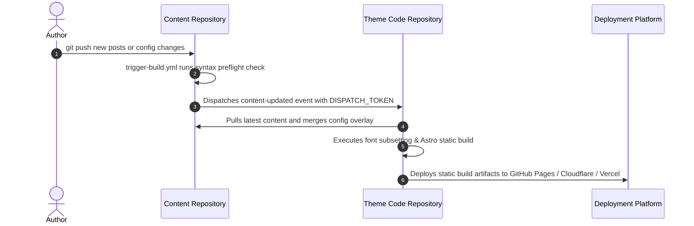

# GitHub Actions Cross-Repo Build Trigger

This is the **most strongly recommended** deployment strategy for Shirone.

In this mode, whenever you push commits to your private content repository, it automatically dispatches an event to your theme code repository. The theme repository's GitHub Actions workflow runs full configuration validation, CJK font subsetting, static compilation, and deploys your site globally.



---

## Step 1: Create a GitHub Personal Access Token (PAT)

Generate a personal access token so the content repository has permission to dispatch build workflows in your theme repository.

1. **Open GitHub Personal Settings**:
   Click your avatar in the upper-right corner on GitHub and select **Settings**.

   
   *Figure 1-1: Settings entry in GitHub personal menu*

2. **Navigate to Developer Settings**:
   Scroll down the left sidebar and click **Developer settings**.

   
   *Figure 1-2: Developer Settings entry at bottom of sidebar*

   
   *Figure 1-3: Developer Settings page overview*

3. **Access Fine-Grained Personal Access Tokens**:
   Select **Personal access tokens** -> **Fine-grained tokens** in the left menu.

   
   *Figure 1-4: Fine-grained tokens navigation*

4. **Generate New Token**:
   Click **Generate new token** in the top-right corner.

   
   *Figure 1-5: Generate new token button*

5. **Configure Token Scope and Permissions**:
   - **Token name**: e.g., `DISPATCH_TOKEN` (or a custom label);
   - **Expiration**: Select a validity period (90 days recommended or custom);
   - **Repository access**: **Choose "Only select repositories"** and select **only your theme code repository**;

     
     *Figure 1-6: Selecting target theme code repository*

   - **Permissions -> Repository permissions**: Expand the list, locate **Contents**, and change access from Read-only to **Read and write** (required for triggering repository dispatch events);

     
     *Figure 1-7: Granting Read and write permissions to Contents*

6. **Generate and Copy Token**:
   Scroll to the bottom, click the green **Generate token** button, and **copy the generated token immediately**.

   
   *Figure 1-8: Token generated successfully; copy token string*

---

## Step 2: Enable Trigger Workflow and Configure Secret

1. **Enable trigger workflow**: In your content repository, rename `.github/workflows/trigger-build.yml.example` to `.github/workflows/trigger-build.yml` (dropping `.example` enables GitHub Actions);
2. **Open Secret Settings**:

1. Open your **personal content repository** (e.g., `my-blog-content`);
2. Click **Settings** in the top tab bar;
3. Select **Secrets and variables** -> **Actions** in the left menu;
4. Click **New repository secret**;
5. Enter secret details:
   - **Name**: Must be `DISPATCH_TOKEN` (exact uppercase);
   - **Secret**: Paste the personal access token copied in Step 1;
6. Click **Add secret** to save.

> **Automated Pipeline Mechanism**:
> Upon new pushes, the [`.github/workflows/trigger-build.yml.example`](../../../.github/workflows/trigger-build.yml.example) workflow reads `secrets.DISPATCH_TOKEN` to send a `content-updated` dispatch event to your theme code repository.

---

## Step 3: Enable Deployment Workflow in Theme Repository

To allow the theme code repository to build and publish automatically upon receiving dispatch events:

1. Open your **theme code repository** (e.g., `Shirone`);
2. Navigate to `.github/workflows/`;
3. Rename `deploy.yml.example` to `deploy.yml` (or create the file);
4. Configure the environment variables at the top of the workflow:
   ```yaml
   env:
     # Replace with your content repository path (e.g., yourname/my-blog-content)
     CONTENT_REPOSITORY: yourname/my-blog-content
     CONTENT_WORKING_COPY: .content-src
   ```
5. **If the content repository is private**:
   - Generate a personal access token with read access to the content repository;
   - In the theme code repository under **Settings** -> **Secrets and variables** -> **Actions**, add a Secret named `CONTENT_REPO_TOKEN` with the token value;
6. Commit and push changes to the main branch.

---

## Step 4: Verify End-to-End Automated Deployment

Push a new commit to your content repository:

```bash
git add .
git commit -m "feat: publish a new blog post"
git push origin main
```

1. Open your content repository's **Actions** tab to confirm that the `Trigger Theme Build` workflow ran and dispatched the event;
2. Switch to your theme code repository's **Actions** tab to watch the build pipeline pull content, subset fonts, and compile static pages;
3. Once completed, refresh your blog to verify the newly published article.

---

## Concurrency Control and Race Prevention

In a dual-repository architecture, if you push changes to your content repository and theme code repository simultaneously, or make multiple rapid pushes to your content repository, Shirone provides robust **concurrency preemption and automatic cancellation**:

1. **Automatic Cancellation of Outdated Builds (Superseding)**:
   The theme repository deployment workflow (`deploy.yml`) is bound to a shared concurrency group (`concurrency: group: deploy, cancel-in-progress: true`). When a newer build request arrives, GitHub Actions **immediately terminates in-progress older builds**, seamlessly switching to the newest run;
2. **Guaranteed Freshness of Code and Content**:
   When the newer build begins, it checks out the **latest theme codebase + latest content posts and configuration overlays**, re-materializing them prior to static compilation and completely eliminating race conditions;
3. **Content Repository Dispatch Debouncing**:
   The content repository's `trigger-build.yml` also configures `group: trigger-build`, automatically canceling redundant in-progress dispatches during rapid consecutive commits to save GitHub Actions runner minutes.
