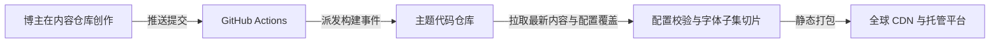

# 什么是内容分离架构

## 基本概念

如果把个人博客比作一栋房子：

- **主题代码仓库**相当于房子的建筑框架、管线与施工：负责交互动效、深浅色模式、响应式布局、图片优化与构建编译，由主题维护者公开维护；
- **个人内容仓库**相当于入住后的家具、照片与日记：包含你的所有文章、说说、相册、个人信息与自定义配置，由你完全掌控，可设为私有仓库。

传统的单仓库模式中，内容与主题源码混合在一起。当你想升级主题版本时，容易与本地文章产生 Git 合并冲突。

Shirone 的**内容分离架构**将两者解耦：你的内容独立保存在私有内容仓库中，主题代码仓库负责拉取内容并完成构建展示。

---

## 双仓工作流程

整个同步与发布流程由自动化脚本驱动：

1. **你在内容仓库中创作**：写完文章后，执行 `git push` 推送到 GitHub；
2. **自动化流水线启动**：内容仓库中的工作流自动通知代码仓库；
3. **同步与配置合并**：代码仓库自动拉取最新文章，并将你的配置与主题默认配置按规则合并；
4. **编译与发布**：代码仓库生成静态网页并部署上线。

---

## 内容分离的核心优势

### 1. 主题升级无冲突

开源主题会持续更新功能与修复问题。
在内容分离模式下，你的文章和配置不在代码仓中。当主题发布新版本时，直接在代码仓同步上游更新即可，不会与个人文章产生合并冲突。

### 2. 保护个人私密内容

你可能希望将主题代码仓库开源公开，但博客内容中常包含：
- 未完成的草稿与生活随笔；
- 个人家庭相册或私密日记；
- 站点的专属凭证配置。

通过双仓架构，你可以将**内容仓库设为私有**，将**代码仓库设为公开**，避免私密内容外泄。

### 3. 专注内容创作

创作者无需频繁处理复杂的构建依赖与工具链。日常只需关注两件事：
- 在 `content/` 目录下用 Markdown 撰写内容；
- 在 `config/` 目录下用简洁的 YAML 文件调整站点信息与颜色。
