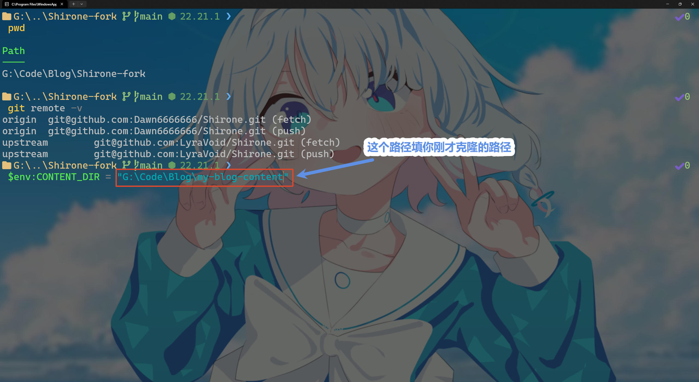
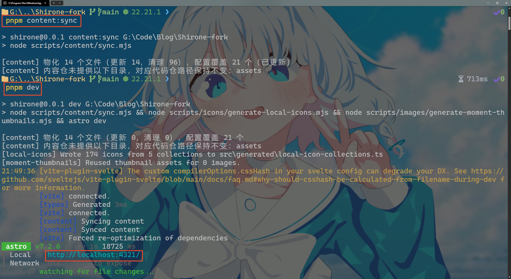

# 本地预览与实时调试

在将文章或配置推送到线上之前，你可以在自己的电脑上启动本地开发服务器，实时查看渲染效果。

---

## 准备工作

确保电脑上已有两个本地文件夹：
1. **主题代码仓库**（例如本地路径为 `D:\Code\Shirone`）；
2. **个人内容仓库**（例如本地路径为 `D:\Code\my-blog-content`）。

并在主题代码仓库目录下已经执行过一次依赖安装：
- Windows：`pnpm.cmd install`
- macOS / Linux：`pnpm install`

---

## 方式一：快速启动本地预览（单次同步）

### 1. 在 Windows 系统中（使用 PowerShell）

进入**主题代码仓库**目录，依次执行：

```powershell
# 1. 设置内容仓库的本地路径（请替换为你电脑上的真实绝对路径）
$env:CONTENT_DIR = "D:\Code\my-blog-content"

# 2. 执行一次内容同步与配置覆盖
pnpm.cmd content:sync

# 3. 启动本地开发服务器
pnpm.cmd dev
```

设置内容路径并执行同步：


*图 1-1：设置内容仓库路径与执行内容同步*

启动开发服务器并在终端查看输出：


*图 1-2：终端启动本地开发服务器输出*

### 2. 在 macOS / Linux 系统中（使用 Bash / Zsh）

进入**主题代码仓库**目录，依次执行：

```bash
# 1. 设置内容仓库的本地路径
export CONTENT_DIR="/Users/yourname/Code/my-blog-content"

# 2. 执行一次内容同步与配置覆盖
pnpm content:sync

# 3. 启动本地开发服务器
pnpm dev
```

终端会输出如下访问地址：

```text
  Local    http://localhost:4321/
```

在浏览器中打开 `http://localhost:4321/`，即可看到完全由你私有内容仓库驱动的博客页面：


*图 1-3：本地浏览器预览博客渲染效果*

---

## 方式二：边写边看（文件变更实时监听）

如果你正在频繁编写 Markdown 文章或调试 YAML 样式，反复手动运行同步命令会很繁琐。
你可以开启**实时监听模式**：

1. **打开第一个终端窗口**（启动博客预览服务）：
   ```powershell
   $env:CONTENT_DIR = "D:\Code\my-blog-content"
   pnpm.cmd dev
   ```
2. **打开第二个终端窗口**（启动实时增量监听）：
   ```powershell
   $env:CONTENT_DIR = "D:\Code\my-blog-content"
   pnpm.cmd content:watch
   ```

此时，只要你在外部编辑器（如 Obsidian、VS Code）中按 `Ctrl + S` 保存任何 Markdown 文件或修改 YAML 配置，监听器会自动将变更同步至代码仓并触发浏览器热重载，体验与在单仓库中直接编写一致。

---

## 进阶命令行工具

除了 `content:sync` 和 `content:watch` 之外，Shirone 还提供了内存预检（`content:validate`）、差异导出（`content:export`）、安全清理（`content:clean`）以及状态查询（`content:status`）等丰富工具。
详细使用指南请参阅：[04. 命令行工具与协同工作流](./04-cli-workflows.md)。

---

## 常见疑问与提示

### 1. 怎么退出本地预览？
在终端中按下键盘快捷键 `Ctrl + C` 即可停止开发服务器或监听器。

### 2. 报错找不到路径怎么办？
请仔细检查 `$env:CONTENT_DIR` 的路径是否为绝对路径，且该目录下是否包含真实的 `config` 与 `content` 文件夹。
