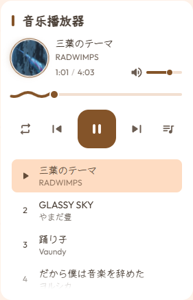

# 侧栏音乐播放器配置

`config/music.yaml` 负责控制博客侧边栏内置的音乐播放器。

---

## 四大工作模式对比与选择

| 模式名称 | `provider` 取值 | 数据来源 | 特点与适用场景 |
| :--- | :--- | :--- | :--- |
| **混合增强模式**（推荐） | `"mixed"` | `data/music.ts` + 云端歌单 | 首屏立即可播本地音乐，后台无感拉取远端歌单；网络异常时静默降级为本地曲目 |
| **本地独立模式** | `"local"` | `data/music.ts` | 零外部网络依赖，首屏直接加载本地资源，离线也能正常播放 |
| **自定义模式** | `"custom"` | YAML 中的 `tracks` 列表 | 适合直接在配置文件中编写几首外链歌曲 |
| **云端歌单模式** | `"meting"` | 网易云 / QQ 音乐公开歌单 | 仅拉取远端平台歌单，曲库海量且封面自动解析 |

播放器展开状态与播放列表展示：


*图 1-1：侧栏音乐播放器展开与播放列表界面*

---

## 模式一：混合增强模式（推荐配置）

```yaml
enable: true
provider: "mixed"

# 默认初始音量（范围 0.0 到 1.0）
defaultVolume: 0.7

# 默认播放循环模式：
# - "sequence"：顺序播放（默认）
# - "repeat-one"：单曲循环
# - "shuffle"：随机播放
defaultMode: "sequence"

# 云端歌单配置
meting:
  server: "netease"     # 音乐平台："netease"（网易云）| "tencent"（QQ音乐）| "kugou"（酷狗）
  type: "playlist"      # 资源类型："playlist" 歌单 | "song" 单曲 | "album" 专辑
  id: "14164869977"     # 歌单 ID
```

---

## 模式二：纯本地独立模式

适合将自己的音乐文件放入 `public/assets/music/` 目录或存放在个人图床对象存储中：

```yaml
enable: true
provider: "local"
defaultVolume: 0.7
defaultMode: "sequence"
```

曲目列表在 `data/music.ts` 中维护，例如：

```typescript
export const musicTracks = [
  {
    id: "song-1",
    title: "口笛で愛は歌えない",
    artist: "Dazbee",
    cover: "assets/images/music/dazbee.webp",
    source: "/assets/music/dazbee.mp3",
    duration: 241
  }
];
```

---

## 模式三：自定义列表模式

直接在 YAML 文件中定义曲目清单：

```yaml
enable: true
provider: "custom"
defaultVolume: 0.7
defaultMode: "sequence"

tracks:
  - id: "custom-1"
    title: "春雷の頃"
    artist: "22/7"
    cover: "https://example.com/cover.webp"
    source: "https://example.com/audio.mp3"
    duration: 242
```

---

## 如何获取网易云歌单 ID

1. 在电脑浏览器中打开 [网易云音乐网页版](https://music.163.com/)；
2. 找到你想要播放的公开歌单并点击进入；
3. 查看浏览器地址栏的链接，例如：
   `https://music.163.com/#/playlist?id=14164869977`
4. 链接末尾的数字 `14164869977` 即为歌单 ID，直接填入 `meting.id` 即可。
