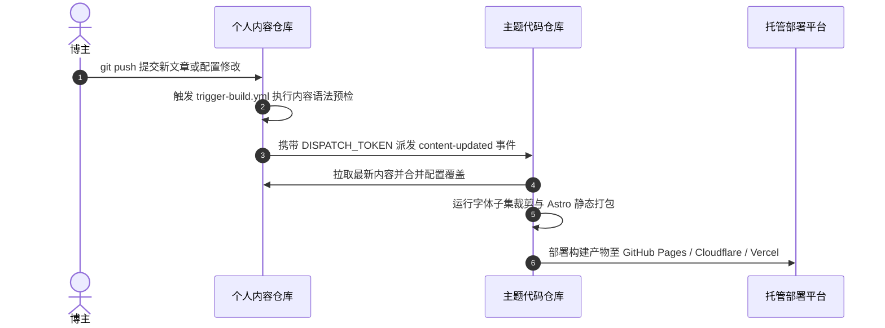
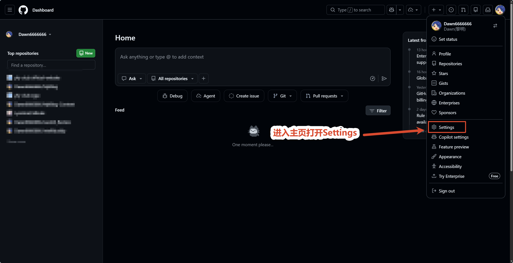
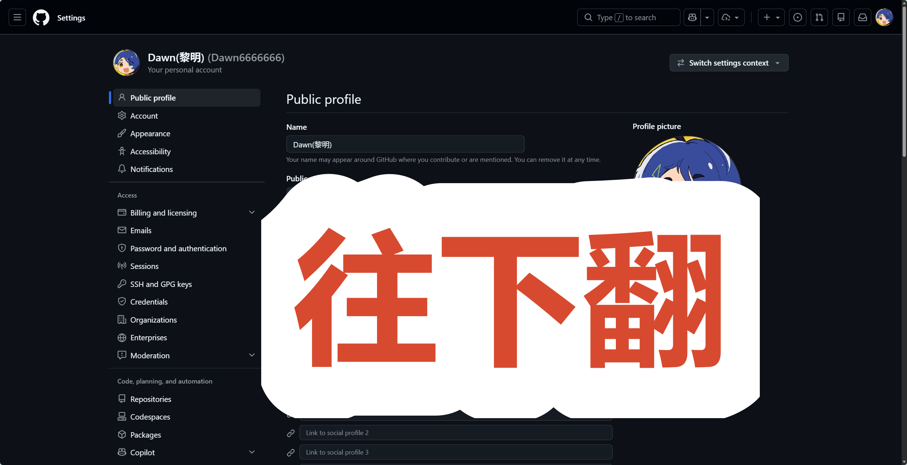
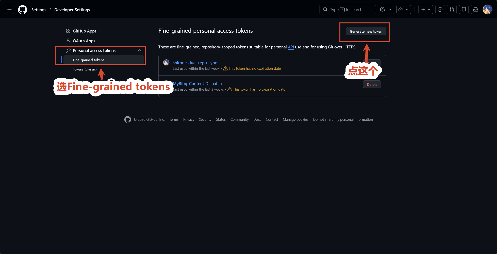
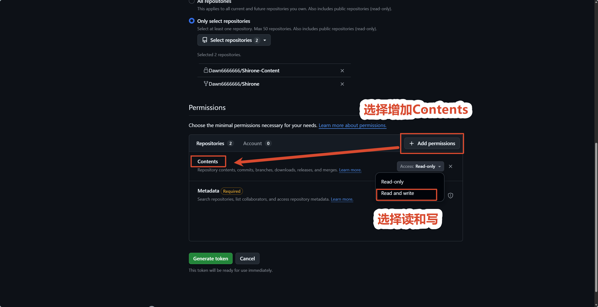

# GitHub Actions 跨仓自动构建

这是官方**最推荐**的自动化部署方案。

在这种模式下，内容仓库每次推送更新，会自动通知主题代码仓库。代码仓库的 GitHub Actions 会执行配置验证、中文字体切片、全量静态构建，并自动发布上线。



---

## 第一步：创建 GitHub 个人访问令牌

我们需要生成一个专用令牌，用来让内容仓库有权限通知代码仓库启动构建。

1. **前往个人设置**：
   点击 GitHub 页面右上角头像，进入设置页面。

   
   *图 1-1：GitHub 个人菜单中的 Settings 入口*

2. **进入开发者设置**：
   在左侧导航栏滑到底部，点击开发者设置。

   
   *图 1-2：左侧底部 Developer Settings 入口*

   
   *图 1-3：Developer Settings 页面概览*

3. **进入细粒度个人访问令牌**：
   依次点击左侧的个人访问令牌下的细粒度令牌。

   
   *图 1-4：Fine-grained tokens 选项*

4. **新建令牌**：
   点击右上角的生成新令牌按钮。

   
   *图 1-5：生成新令牌按钮*

5. **配置令牌属性与权限**：
   - **Token name**：填入 `DISPATCH_TOKEN`（或自定义名称）；
   - **Expiration**：选择过期时间（建议选择 90 天或根据需求设置）；
   - **Repository access**：**务必选择“Only select repositories”**，并在下拉菜单中**只勾选你的主题代码仓库**；

     
     *图 1-6：指定生效的主题代码仓库*

   - **Permissions -> Repository permissions**：展开仓库权限列表，找到 **Contents**，将其权限由只读修改为 **Read and write**（用于触发工作流派发）；

     
     *图 1-7：赋予 Contents 读写权限*

6. **生成并妥善复制令牌**：
   滑动至页面最底部，点击绿色按钮生成令牌。**立即复制生成的令牌字符串并妥善保存**。

   
   *图 1-8：创建成功并复制令牌密钥*

---

## 第二步：启用触发工作流并配置派发密钥

1. **启用触发工作流**：在内容仓库中，将 `.github/workflows/trigger-build.yml.example` 重命名为 `.github/workflows/trigger-build.yml`（去掉 `.example` 后缀后 Actions 才会识别并执行）；
2. **进入密钥设置**：

1. 打开你的**个人内容仓库**（例如 `my-blog-content`）；
2. 点击顶部导航栏的 **Settings**；
3. 在左侧菜单中找到 **Secrets and variables**，点击展开并选择 **Actions**；
4. 点击页面右侧的绿色按钮 **New repository secret**；
5. 填写密钥信息：
   - **Name**：必须填入 `DISPATCH_TOKEN`（注意全大写）；
   - **Secret**：粘贴第一步中复制的个人访问令牌字符串；
6. 点击底部的 **Add secret** 保存。

> **自动化原理解析**：
> 内容仓推送新提交时，[`.github/workflows/trigger-build.yml.example`](../../../.github/workflows/trigger-build.yml.example) 工作流会读取 `secrets.DISPATCH_TOKEN` 向你的主题代码仓派发 `content-updated` 事件。

---

## 第三步：在主题代码仓启用部署工作流

为了让主题代码仓接收到派发事件后能够自动执行构建与发布，需要在代码仓启用部署工作流：

1. 打开你的**主题代码仓库**（例如 `Shirone`）；
2. 进入目录 `.github/workflows/`；
3. 将示例工作流 `deploy.yml.example` 重命名为 `deploy.yml`（或新建该文件）；
4. 修改文件开头的环境变量配置：
   ```yaml
   env:
     # 替换为你的内容仓库路径（如 yourname/my-blog-content）
     CONTENT_REPOSITORY: yourname/my-blog-content
     CONTENT_WORKING_COPY: .content-src
   ```
5. **如果内容仓是私有仓库**：
   - 生成一个具备内容仓读取权限的个人访问令牌；
   - 在主题代码仓的 **Settings** -> **Secrets and variables** -> **Actions** 中添加 Secret，名称为 `CONTENT_REPO_TOKEN`，值为该令牌；
6. 提交并推送到代码仓的主分支。

---

## 第四步：验证全自动构建与发布

现在，只需在内容仓库中修改任意一篇文章并执行推送：

```bash
git add .
git commit -m "feat: 发布一篇新文章"
git push origin main
```

1. 打开内容仓库的 **Actions** 页面，你将看到 `Trigger Theme Build` 工作流被自动触发并成功派发事件；
2. 随后打开代码仓库的 **Actions** 页面，你将看到主题代码仓正在全自动拉取内容并完成编译部署；
3. 构建完成后，刷新你的博客网站，新文章即可完成全网发布。

---

## 并发构建与防冲突机制

在双仓架构下，如果你在推送内容仓库的同时又推送了主题代码仓库，或者短时间内连续多次向内容仓提交文章，系统具备完善的**并发抢占与自动截断保障**：

1. **自动取消旧构建（后发先至）**：
   代码仓的部署流水线（`deploy.yml`）配置了全局并发控制（`concurrency: group: deploy, cancel-in-progress: true`）。当有新的构建请求到达时，GitHub Actions 会**立即自动打断并取消正在进行中的旧构建**，无缝切换到最新一次构建；
2. **状态自动保持最新**：
   后一次构建启动时，会自动拉取**最新代码仓源码 + 最新内容仓文章与配置**，两者在打包前重新执行增量物化，彻底杜绝并发冲突或旧文章覆盖新内容；
3. **内容仓防抖截断**：
   内容仓的 `trigger-build.yml` 同样配置了 `group: trigger-build`，多次连续 Push 只会保留最新一次派发，避免浪费 GitHub Actions 运行分钟数。
